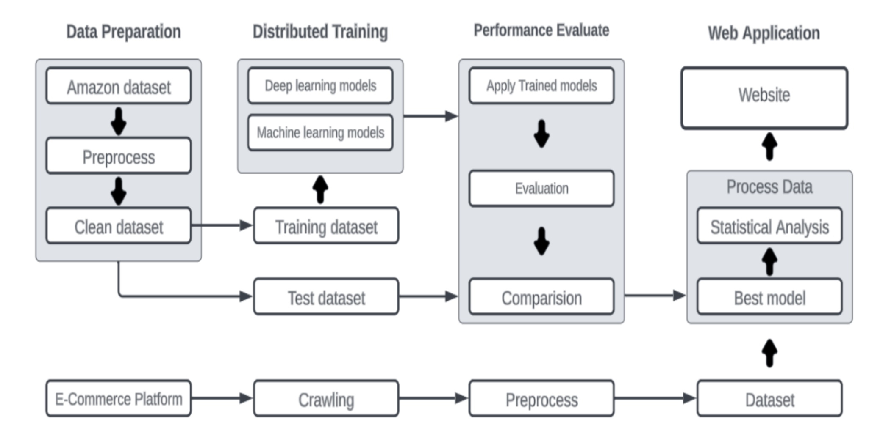
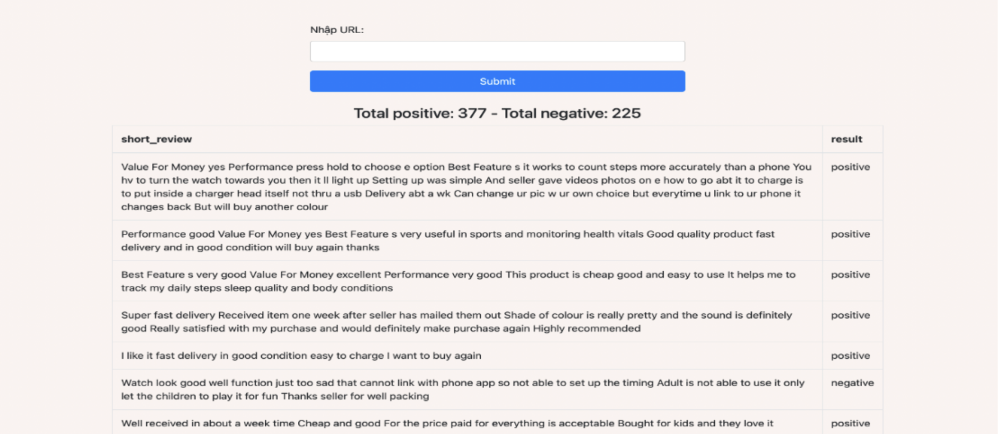

# REAL TIME SENTIMENT ANALYSIS
It's a project using bigdata technique, in here we use spark and deep learning, machine learning model for real time sentiment analysis of customer in shopee.

>Tech stacks:
* Keywords:
    - Bigdata, NLP, Sentiment Analysis, SparkNLP, Opinion mining.
* Technique:
    - BERT, LSTM, MLP, HashingTF-IDF-Random Forest,...
* Dataset:
  - Amazon product reviews.

**1. Approach to the sentiment analysis**

**2. Interface of website showing result (URL OF SHOPEE)**

